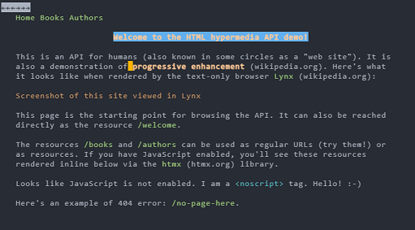

= Hypermedia htmx API demo

**MOVED!** Hello, I am moving my repos to http://ratfactor.com/repos/
and setting them to read-only ("archived") on GitHub. Thank you, _-Dave_

See it live here:

http://hypermedia.ratfactor.com

PHP demonstration "book database" with an HTML
https://en.wikipedia.org/wiki/Hypermedia[hypermedia] API using
https://htmx.org/[htmx] to render HTML content inline as needed.

What makes HTML hypermedia APIs special is that they can be used
directly by a human with a browser. In a sense, _all_ traditional
websites are HTML hypermedia APIs.

